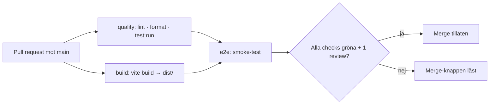

# Pipeline – Kraftly Mina sidor

## Flöde

## Beslut 1 · Jobb: parallellt eller i serie?

Vi valde att köra e2e i serie efter quality och build via needs, eftersom det sparar CI-minuter — en PR med lintfel eller trasigt bygge stoppas innan vi lägger tid på att starta mock-API, dev-server och Cypress. Nackdelen är längre svarstid: en PR som redan är grön på quality/build väntar ändå ut de jobben innan e2e ens börjar, istället för att köra allt samtidigt.

## Beslut 2 · Vad krävs för merge?

- Required checks: quality, build, e2e
- Approvals: 1
- Up to date: ja
- Bypass: ingen, inte ens tech lead

## Beslut 3 · Protokoll vid röd main

Den som pushar/mergar och upptäcker att main blir röd flaggar det direkt i Slack-kanalen — ingen ska behöva leta reda på vem som gjorde det.

Personen som orsakade felet (eller den som är tech lead den veckan, om personen inte är tillgänglig) får 15 minuter på sig att felsöka och laga framåt med en ny commit.

Är felet inte löst inom 15 minuter: revertera mergen som gjorde main röd, så att main är grön igen medan felet utreds i lugn och ro på en egen branch. Ingen forcerar igenom en fix eller kringgår rulesetet för att "bara få det grönt" — det gäller oavsett hur nära deadline det är.

Vid nästa arbetstillfälle (tisdag eller fredag 10.00) tas det upp kort i retrospektivet: vad gick sönder och varför slank det igenom checkarna.

## Byggtid: före och efter npm-cache

| Steg             | Utan cache | Med cache |
| ---------------- | ---------- | --------- |
| npm ci (quality) | 31s        | 29s       |
| npm ci (build)   | 29s        | 25s       |
| Hela körningen   | 1m0s       | 54s       |

**Skärmdumpar:**

## Skärmdump: låst merge-knapp

**PR med medvetet lintfel: https://github.com/gahnejennifer/Kraftly_Watt/pull/28**

