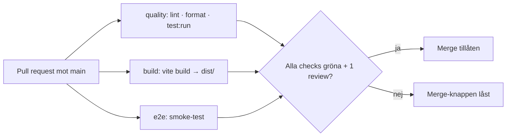
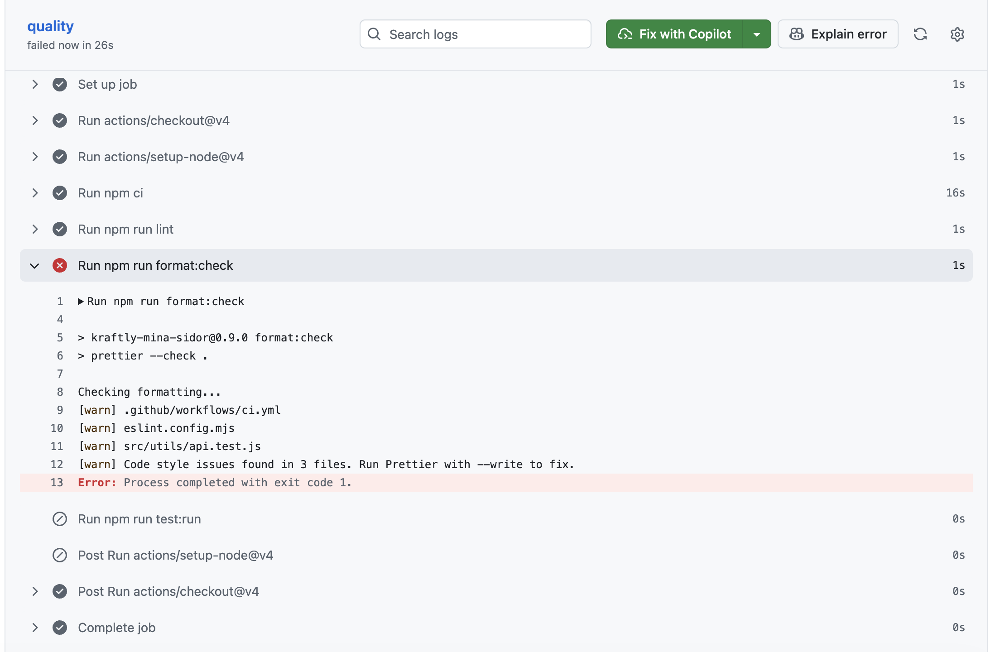

# Pipeline – Kraftly Mina sidor

## Flöde

## Beslut 1 · Jobb: parallellt eller i serie?

Hur ni delade upp jobben och varför. Vad kostar det i minuter, vad ger det i svarstid?

## Beslut 2 · Vad krävs för merge?

Vilka checks är required, hur många approvals, up to date ja/nej, bypass för någon?

## Beslut 3 · Protokoll vid röd main

Vem gör vad, inom vilken tid. Laga framåt eller revert – var går gränsen? (Aldrig runt.)

## Byggtid: före och efter npm-cache

| Steg             | Utan cache | Med cache |
| ---------------- | ---------- | --------- |
| npm ci (quality) | 31s        | 29s       |
| npm ci (build)   | 29s        | 25s       |
| Hela körningen   | 1m0s       | 54s       |

Skärmdumpar:

## Skärmdump: låst merge-knapp

