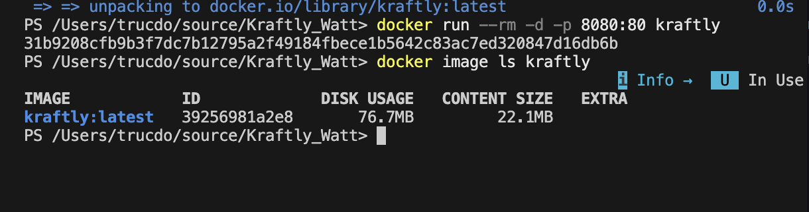

# M3

1. Varför kopieras package\*.json före resten av koden?
   - Detta görs för att optimera byggtiden genom att utnyttja Dockers inbyggda cache-system (layer caching).Genom att först kopiera package\*.json och därefter köra installationen (npm ci), sparas installationen av beroendena i ett eget lager. När du senare gör ändringar i din källkod (och kopierar in resten av koden efteråt) behöver Docker inte installera om alla paket varje gång, utan kan återanvända cachen, vilket gör att framtida byggen går mycket snabbare.

2. Vad händer med node_modules från steg 1 – var tar den vägen?
   - Dockerfilen använder en så kallad "multi-stage build". I det första steget byggs appen i en Node-miljö. I det andra steget skapas den slutgiltiga imagen ("bara det här blir imagen") utifrån en Nginx-image (nginx:1.27-alpine). Eftersom koden endast kopierar den färdigbyggda mappen (COPY --from-build/app/dist...) till den nya Nginx-imagen, lämnas node_modules och all annan källkod kvar i det första steget. Den tar därmed ingen plats alls i din slutgiltiga, optimerade container.

3. Varför finns det ingen CMD?
   - Den slutgiltiga imagen baseras på nginx:1.27-alpine. Officiella bas-images (som Nginx) har redan ett standardkommando för CMD inbakat i sig från skaparna (i det här fallet ett kommando som startar Nginx i förgrunden).Eftersom vi vill använda Nginx standardbeteende för att servera filerna behöver vi inte skriva över detta med ett eget CMD. Vår container ärver helt enkelt startkommandot från Nginx-imagen.

## Steg 2

- building tog 14.1 s

## Steg 3

- building tog 3.9 s
- 87.1MB (disk usage) och 27.6MB (content size)

# Storlekstabell

| Byggmetod          | Dockerfile-typ                             | Disk Usage |
| ------------------ | ------------------------------------------ | ---------- |
| Steg 1 (Naiv)      | Enkel byggnad / Enkel stage (utan banting) | 87.1MB     |
| Steg 2 (Optimerad) | Multi-stage (Node + Nginx Alpine)          | 76.7MB     |

## Tekniska beslut

1. **Val av basimage:**
   Vi valde nginx:1.27-alpine som basimage för vår slutgiltiga container. Alpine-versionen är extremt lätt och innehåller enbart det som är nödvändigt för att köra webbservern, vilket drastiskt minskar filstorleken och attackytan jämfört med en standard Debian/Ubuntu-basimage.

2. **Hur mock-API:t körs:**
   Mock-API:t körs i en separat container (med Node.js som basimage) via Docker Compose snarare än att bakas in i samma container som frontenden. Detta ger en renare separation av ansvarsområden och speglar en mer verklighetstrogen mikrotjänstarkitektur där frontend och backend lever i varsin miljö.

3. **Hur webbläsaren når API:t:**
   Proxy via nginx (`/api`) - vi valde detta framför publicerad port (localhost:4000) därför att det separerar klienten från infrastrukturen och gör att anropen kan ske relativt.

   _Konsekvens för vecka 5 (staging utan localhost):_
   Eftersom vi använder en relativ sökväg (`/api`) och Nginx som proxy, behöver vi inte hårdkoda någon `localhost`-adress i frontend-koden. När applikationen flyttas till en riktig server eller staging-miljö (utan `localhost`) kommer Nginx i container-nätverket automatiskt att styra om trafiken till rätt backend-tjänst baserat på domännamn eller container-namn. Detta gör att builden förblir helt miljöoberoende och inte bryts när `localhost` försvinner.
